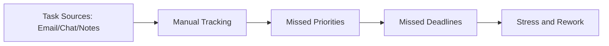
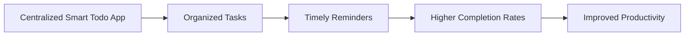

# Smart Todo App - Problem Statement

## Problem Context
Three major user groups are affected by fragmented task management:

| Segment | Typical Context | Core Frictions |
|---|---|---|
| Students | Coursework, assignments, exams, group work | Deadline collisions, ad-hoc planning |
| Professionals | Meetings, deliverables, operational tasks | Context switching, follow-up leakage |
| Freelancers | Multiple clients, invoices, delivery milestones | Priority conflicts, missed reminders |

## Current State (As-Is)
1. Tasks are captured in disconnected tools (notes, chat, calendar, spreadsheets).
2. Reminder coverage is inconsistent and often manual.
3. Priority and due date signals are weak, so users react late.
4. Progress visibility is poor, reducing confidence and accountability.

## Future State (To-Be)
1. Unified task system with clear metadata (priority, category, due date).
2. Reliable reminder engine with configurable channels.
3. Search/filter/dashboard features for planning and course correction.
4. Security and reliability baseline suitable for enterprise and academic contexts.

## Business Impact
| Impact Area | Current Cost | Expected Benefit |
|---|---|---|
| Deadline misses | Rework, grade/performance penalties | Reduction in missed commitments |
| Planning overhead | Time lost in tool switching | Faster daily/weekly planning |
| Task visibility | Reactive execution | Proactive prioritization |
| User confidence | Low trust in personal systems | Improved consistency and control |

## Problem Statement
Users across academic and professional environments lack a unified, dependable, and insight-driven task management system. This causes missed deadlines, inconsistent execution, and reduced productivity. Smart Todo App addresses this by providing structured task orchestration, reminders, and measurable progress tracking in one secure web platform.

