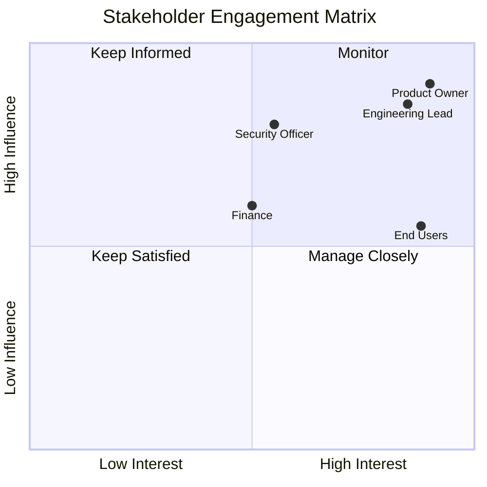

# Smart Todo App - Stakeholder Analysis

## Stakeholder Categories

### Primary Stakeholders
| Stakeholder | Role | Key Expectation |
|---|---|---|
| End Users (Students, Professionals, Freelancers) | Daily platform users | Fast, reliable task and reminder experience |
| Product Owner | Value prioritization | Outcome-oriented feature delivery |

### Secondary Stakeholders
| Stakeholder | Role | Key Expectation |
|---|---|---|
| Customer Support | User issue resolution | Clear diagnostics and predictable UX |
| Training/Academic Faculty | Teaching resource consumers | End-to-end traceable documentation |

### Internal Stakeholders
Engineering, QA, DevOps, Security, UX, Product Management, Finance.

### External Stakeholders
Cloud provider (AWS), email delivery vendor, university reviewers, auditors/compliance entities.

## Stakeholder Influence-Interest Matrix
| Stakeholder | Influence | Interest |
|---|---|---|
| Product Owner | High | High |
| Engineering Lead | High | High |
| QA Lead | Medium | High |
| DevOps Lead | Medium | Medium |
| Security Officer | High | Medium |
| End Users | Medium | High |
| Finance | Medium | Medium |
| University Instructor | Medium | High |
| External Auditor | Low | Medium |

## Engagement Strategy

## RACI Matrix
| Deliverable | Product Owner | BA | Architect | Engineering | QA | DevOps | Security | Instructor/Reviewer |
|---|---|---|---|---|---|---|---|---|
| PRD | A | R | C | C | C | I | C | C |
| SRS | A | R | C | C | C | I | C | C |
| Architecture Design | C | C | A/R | R | C | C | C | I |
| API Design | C | C | A | R | C | I | C | I |
| Implementation | I | I | C | A/R | C | C | C | I |
| Test Plan & Cases | I | C | C | C | A/R | I | C | I |
| Release Readiness | A | I | C | R | R | R | C | I |
| Signoff | A | C | C | C | C | C | C | R |

**Legend:** R = Responsible, A = Accountable, C = Consulted, I = Informed.

