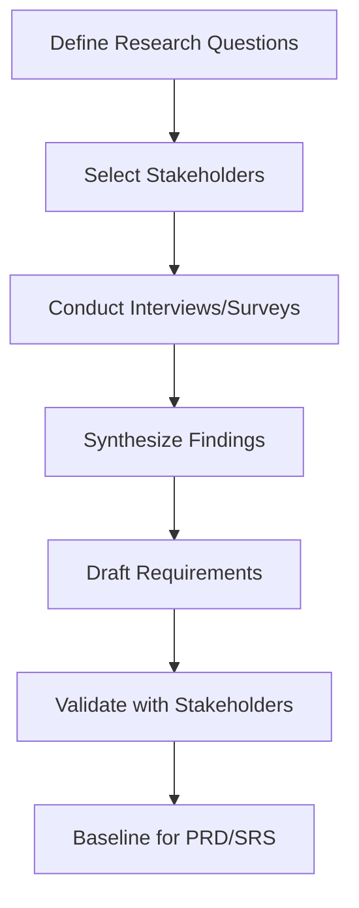

# Smart ToDo - Information Gathering Report

## Why Information Gathering Is Necessary
Requirement quality determines delivery quality. Without disciplined elicitation, teams ship features that are technically correct but operationally misaligned. This phase reduced ambiguity and established a shared, testable scope.

## Requirement Elicitation Goals
| Goal ID | Goal |
|---|---|
| EG-01 | Identify root productivity problems and high-frequency failure points |
| EG-02 | Convert user pain into measurable requirements (FR/NFR) |
| EG-03 | Validate feasibility and constraints early |
| EG-04 | Build traceable artifacts for engineering and academic review |

## Methodology Used
| Method | Target Group | Purpose | Output |
|---|---|---|---|
| Interviews | Students, engineers, PMs, freelancers | Deep qualitative insights | Persona pain maps, candidate stories |
| Surveys | 150 participants | Quantitative prioritization | Feature demand and severity ranking |
| Observation | Task planning sessions | Workflow behavior validation | Process bottlenecks |
| Document Analysis | Existing tools and reports | Gap and best-practice comparison | Baseline capability matrix |

## Elicitation Process

## Key Findings
| Finding ID | Finding | Requirement Implication |
|---|---|---|
| IF-01 | Users forget commitments when reminders are not linked to due date context | FR-029..FR-033, NFR-012 |
| IF-02 | Search and filtering are critical for users with 50+ active tasks | FR-022..FR-026, NFR-002 |
| IF-03 | People need visual progress trends, not only task lists | FR-034..FR-036 |
| IF-04 | Trust declines quickly when login/session behavior is unreliable | FR-001..FR-008, NFR-010..NFR-013 |
| IF-05 | Users need timezone-safe reminders for remote work/study | FR-042, NFR-003 |

## Requirement Themes
1. **Reliability first:** reminders, notifications, and session handling.
2. **Planning speed:** quick create/edit/filter with low latency.
3. **Decision support:** dashboards and overdue insights.
4. **Security baseline:** JWT auth, encryption in transit, auditability.

## Outcome
The elicitation output became the baseline for PRD, user stories, FR/NFR, use cases, SRS, design, and QA traceability.
