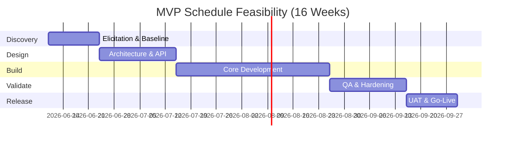

# Smart ToDo - Feasibility Analysis

## Feasibility Summary
| Dimension | Status | Conclusion |
|---|---|---|
| Technical | Feasible | Stack supports required scale and security baseline |
| Economic | Feasible | Positive ROI with phased rollout |
| Operational | Feasible | Teams and processes can support operations |
| Legal | Feasible with controls | Requires privacy policy and retention governance |
| Schedule | Feasible with phased scope | MVP in 16 weeks, enhancements in later phases |
| Risk | Manageable | Mitigation plan documented in Risk Register |

## Technical Feasibility
- **Frontend:** React (TypeScript) supports modular UI, type safety, and responsive design.
- **Backend:** Python FastAPI provides high-performance async APIs, strong validation, and rapid development.
- **Database:** AWS DynamoDB supports managed NoSQL scalability, low-latency key access, and high availability.
- **Auth:** JWT fits stateless scaling and API-first architecture.
- **Deployment:** Docker on AWS supports repeatable environments and managed scalability.

## Economic Feasibility
### Cost Estimate (Year 1)
| Cost Component | Estimated Cost (USD) |
|---|---|
| Engineering and QA | 120,000 |
| Cloud infrastructure | 18,000 |
| Tooling/Monitoring | 8,000 |
| Contingency (10%) | 14,600 |
| **Total** | **160,600** |

### Benefit Estimate (Year 1)
| Benefit Component | Estimated Value (USD) |
|---|---|
| Productivity gain (time saved) | 210,000 |
| Reduction in deadline-related rework | 60,000 |
| Retention and usage value | 45,000 |
| **Total** | **315,000** |

**Net Benefit:** 154,400 USD (positive ROI).

## Operational Feasibility
| Area | Readiness | Notes |
|---|---|---|
| Product/Engineering workflow | High | Agile backlog and release cadence in place |
| Support readiness | Medium | Requires runbook and FAQ during MVP |
| Monitoring and incident response | Medium | Baseline dashboards and alerting required |

## Legal Feasibility
1. User data handling must align with privacy policy and consent requirements.
2. Access logs and audit trails must support incident review.
3. Data retention and account deletion workflows must be defined.

## Schedule Feasibility

## Cost-Benefit Analysis
| Metric | Value |
|---|---|
| Total Cost | 160,600 USD |
| Total Benefit | 315,000 USD |
| Net Benefit | 154,400 USD |
| ROI | 96.1% |
| Payback Period | ~6.1 months |

## Risk Feasibility
| Risk Category | Feasibility Concern | Mitigation |
|---|---|---|
| Technical | Reminder scalability under burst loads | Queue-based scheduler, load testing |
| Security | JWT misuse/token theft | Short-lived access tokens, rotation, monitoring |
| Schedule | Scope expansion | Strict change control, phased roadmap |
| Operational | Alert fatigue or missed incidents | SLO-based monitoring and on-call process |

## Conclusion
Smart ToDo is feasible across technical, economic, operational, and schedule dimensions when delivered in phased increments with explicit risk controls.
