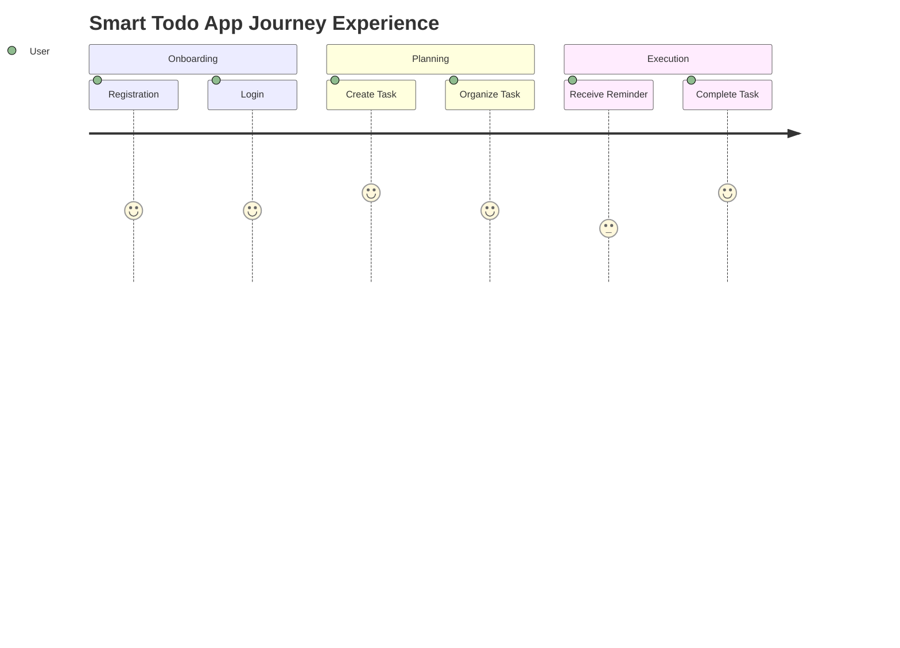

# Smart Todo App - User Journey Map

## Journey Stages
Registration -> Login -> Create Task -> Organize Task -> Receive Reminder -> Complete Task

## End-to-End Journey Table
| Stage | User Goal | User Actions | System Response | Pain Risk | Improvement Opportunities | Linked IDs |
|---|---|---|---|---|---|---|
| Registration | Create account quickly | Submit name, email, password | Validate input, create user, issue token | Form errors/confusion | Inline validation and clear error messages | UC-01, FR-001..FR-003 |
| Login | Access workspace securely | Enter credentials | Authenticate and issue JWT | Failed auth loops | Clear feedback + lockout policy | UC-02, FR-004..FR-007 |
| Create Task | Capture commitment | Add title, due date, category, priority | Persist task and show in list | Data entry friction | Quick-add + sensible defaults | UC-03, FR-009, FR-014..FR-016 |
| Organize Task | Prioritize and plan | Filter/sort/search tasks | Return structured task views | Hard to find important work | Saved filters and due-soon view | UC-06, UC-07, FR-022..FR-026 |
| Receive Reminder | Avoid missing deadlines | Receive in-app/email reminder | Trigger reminder based on schedule | Late or noisy reminders | User-configurable reminder rules | UC-08, FR-029..FR-033, FR-042 |
| Complete Task | Close work and track progress | Mark task complete | Update status, dashboard, audit log | Completion not reflected in metrics | Immediate KPI refresh | UC-09, FR-012, FR-034, FR-037 |

## Experience Heatmap

## Key Journey Improvements
1. Reduce friction in registration/login with explicit validation and recovery paths.
2. Improve reminder precision (timezone and lead-time controls).
3. Tighten loop between completion action and dashboard feedback.

