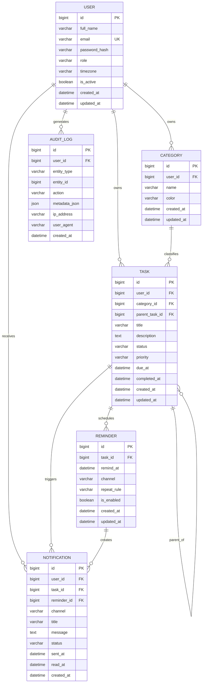

# Smart ToDo - Entity Relationship Diagram (ERD)

## Entity Overview
| Entity | Purpose |
|---|---|
| User | Stores account, identity, and timezone preferences |
| Category | Organizes user tasks by domain/context |
| Task | Core work item with status, due date, and priority |
| Reminder | Defines reminder schedules and channels for tasks |
| Notification | Stores generated in-app/email notification events |
| AuditLog | Captures security and task lifecycle audit events |

## Entity Attributes
### User
`id, full_name, email, password_hash, role, timezone, is_active, created_at, updated_at`

### Category
`id, user_id, name, color, created_at, updated_at`

### Task
`id, user_id, category_id, title, description, status, priority, due_at, completed_at, parent_task_id, created_at, updated_at`

### Reminder
`id, task_id, remind_at, channel, repeat_rule, is_enabled, created_at, updated_at`

### Notification
`id, user_id, task_id, reminder_id, channel, title, message, status, sent_at, read_at, created_at`

### AuditLog
`id, user_id, entity_type, entity_id, action, metadata_json, ip_address, user_agent, created_at`

## Relationship Rules
1. One **User** has many **Tasks**, **Categories**, **Notifications**, and **AuditLogs**.
2. One **Category** has many **Tasks**.
3. One **Task** has many **Reminders** and **Notifications**.
4. **Task.parent_task_id** creates self-referencing hierarchy for subtasks.
5. One **Reminder** may trigger multiple **Notifications** (retries/channels).

## Mermaid ER Diagram

