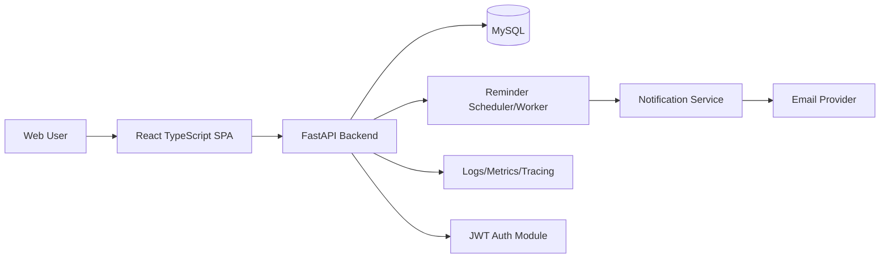
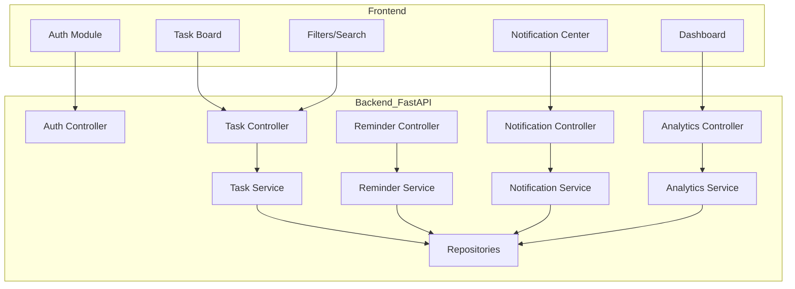
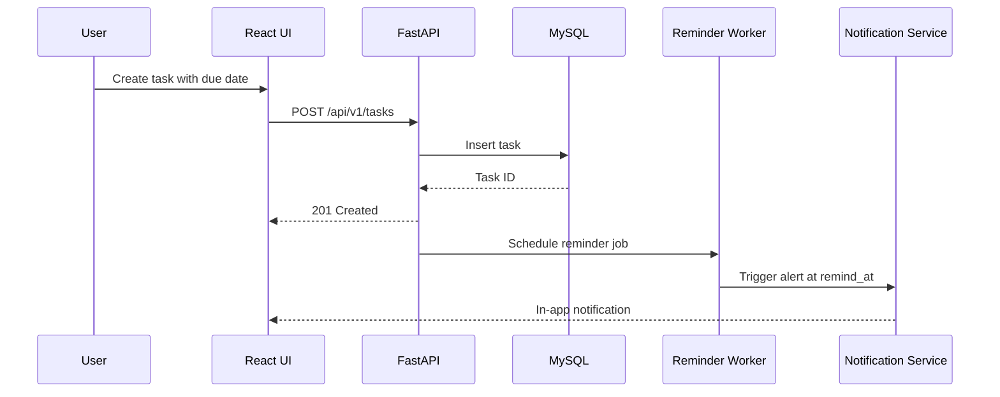
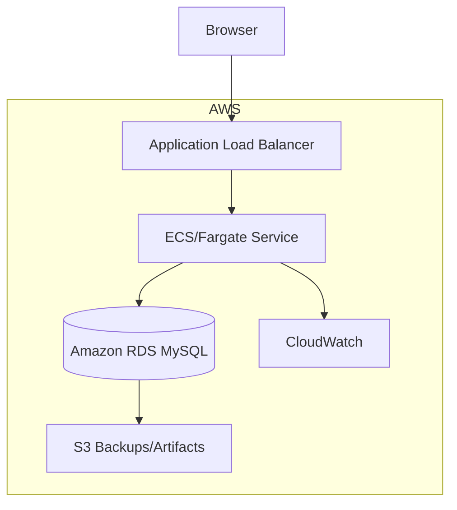

# Smart ToDo - System Design

## High-Level Design
Smart ToDo follows a layered, API-first architecture:
1. **Presentation Layer:** React (TypeScript) SPA.
2. **Application Layer:** FastAPI services (auth, tasks, reminders, notifications, analytics).
3. **Data Layer:** MySQL for transactional storage.
4. **Platform Layer:** Dockerized deployment on AWS with observability.

## Architecture Diagram

## Component Diagram

## Data Flow

## Security Architecture
| Layer | Control |
|---|---|
| Identity | JWT access + refresh tokens |
| API | Route-level authorization and input validation |
| Data | Encryption in transit (TLS), hashed passwords |
| Audit | Auth and critical action logging with trace IDs |
| Platform | Secret management via AWS services and restricted IAM roles |

## Deployment Architecture

