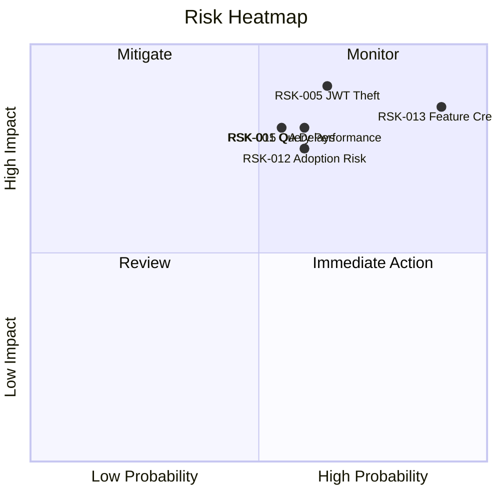

# Smart Todo App - Risk Analysis

## Risk Register
| Risk ID | Category | Description | Probability | Impact | Mitigation | Owner |
|---|---|---|---|---|---|---|
| RSK-001 | Technical | Search/filter queries degrade with large datasets | Medium | High | Add composite indexes, query tuning, load tests | Backend Lead |
| RSK-002 | Technical | Reminder scheduler lag under burst load | Medium | High | Queue-based scheduling, autoscaling workers | Architect |
| RSK-003 | Technical | Data migration/import errors from CSV | Medium | Medium | Strict validation, dry-run import mode | Backend Lead |
| RSK-004 | Technical | Third-party email provider instability | Medium | Medium | Retry policy, fallback provider option | DevOps Lead |
| RSK-005 | Security | JWT token theft or misuse | Medium | High | Short token TTL, rotation, device/session controls | Security Lead |
| RSK-006 | Security | Unauthorized data access via broken auth checks | Low | Critical | Mandatory auth middleware and endpoint tests | Security Lead |
| RSK-007 | Security | Injection/XSS vulnerability | Medium | High | Input sanitization/allowlists, safe DynamoDB expression construction, output encoding, security testing | QA Security Engineer |
| RSK-008 | Security | Sensitive data leakage in logs | Low | High | Log redaction policy and secure logging review | Platform Engineer |
| RSK-009 | Operational | Incomplete monitoring causing late incident detection | Medium | High | SLO dashboards and alert coverage audits | DevOps Lead |
| RSK-010 | Operational | Insufficient runbooks for support | Medium | Medium | Create incident runbooks and support playbooks | Product Ops |
| RSK-011 | Operational | Environment drift across dev/staging/prod | Medium | Medium | IaC and immutable container images | DevOps Lead |
| RSK-012 | Business | Low adoption due to weak onboarding UX | Medium | High | Improve onboarding guidance and first-task flow | Product Manager |
| RSK-013 | Business | Feature creep extends timeline | High | High | Scope gate and change-control board | Product Owner |
| RSK-014 | Business | KPI targets not achieved in first release | Medium | Medium | A/B experiments and iterative roadmap | Product Manager |
| RSK-015 | Schedule | Delays in QA cycle due to unstable builds | Medium | High | CI hardening and release branch policy | Engineering Manager |
| RSK-016 | Schedule | Cloud setup delays block staging tests | Medium | Medium | Early infrastructure provisioning | DevOps Lead |
| RSK-017 | Legal/Compliance | Privacy policy misalignment with data retention | Low | High | Legal review and retention automation | Compliance Officer |
| RSK-018 | Legal/Compliance | Incomplete user deletion workflows | Medium | Medium | Implement audited deletion/deactivation process | Backend Lead |

## Risk Heatmap (Qualitative)

## Risk Response Policy
1. High probability + high impact risks must have owners and weekly review.
2. Critical security risks block release until mitigated.
3. Schedule and scope risks require change-control decisions from Product Owner.
