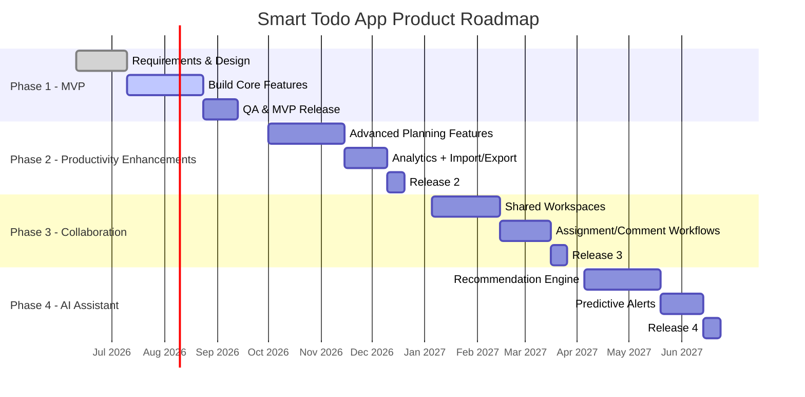

# Smart Todo App - Project Roadmap

## Roadmap Strategy
Delivery is phased to maximize early value while controlling risk:
1. MVP core reliability and execution features
2. Productivity enhancement depth
3. Collaboration capabilities
4. AI-assisted planning

## Phase Plan
| Phase | Theme | Key Deliverables | Duration |
|---|---|---|---|
| Phase 1 | MVP | Auth, task CRUD, categories, reminders, search/filter, dashboard basics | Q3 2026 |
| Phase 2 | Productivity Enhancements | Recurrence, bulk operations, advanced analytics, export/import | Q4 2026 |
| Phase 3 | Collaboration | Shared task lists, comments, assignments, activity streams | Q1 2027 |
| Phase 4 | AI Assistant | Smart prioritization, deadline risk prediction, planning suggestions | Q2 2027 |

## Mermaid Gantt Timeline

## Milestones
| Milestone | Target |
|---|---|
| M1: Requirements Baseline Approved | July 2026 |
| M2: MVP Production Release | September 2026 |
| M3: Productivity Release | December 2026 |
| M4: Collaboration Release | March 2027 |
| M5: AI Assistant Release | June 2027 |

