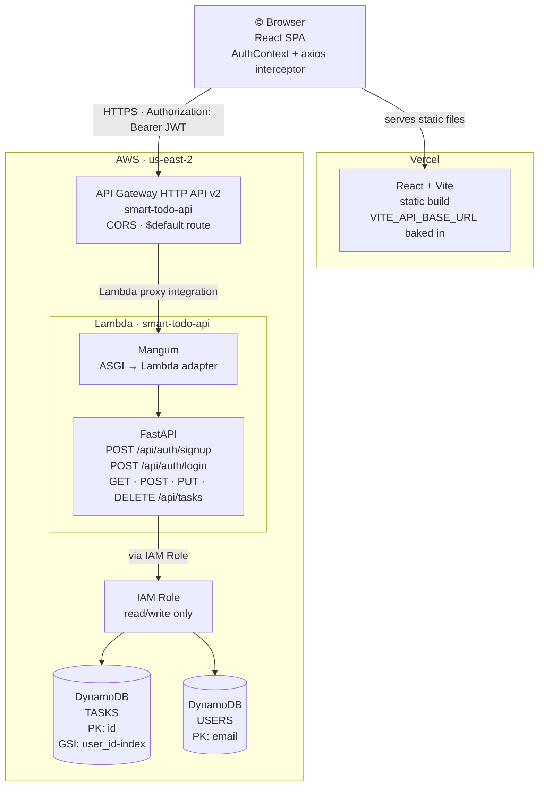
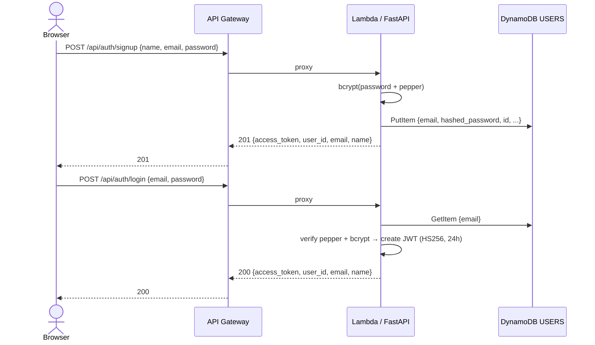
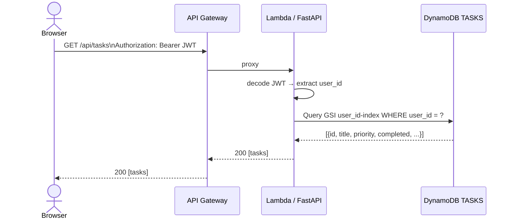
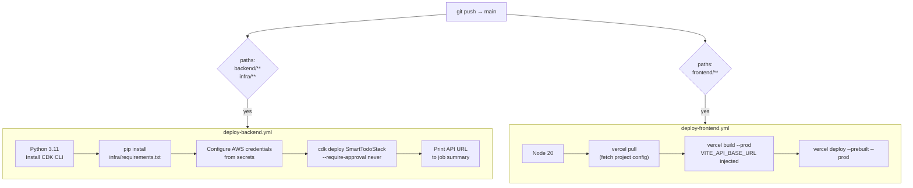
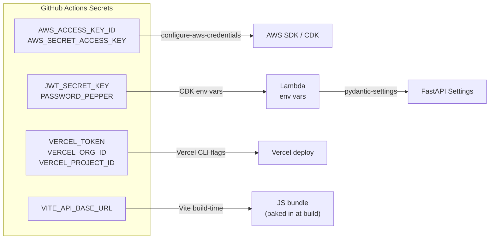

# Infrastructure Architecture

## Overview

Smart Todo is split into two independently deployed layers:

| Layer | Platform | URL |
|-------|----------|-----|
| Frontend (React + Vite) | Vercel | `https://smart-todo-ruby.vercel.app` |
| Backend (FastAPI + Mangum) | AWS Lambda + API Gateway | `https://55t0c7lyce.execute-api.us-east-2.amazonaws.com` |
| Database | AWS DynamoDB | `us-east-2` |

---

## Architecture Diagram

---

## Request Flow

### Auth (Signup / Login)

### Authenticated Task Request

---

## Security Model

| Concern | Solution |
|---------|----------|
| Password storage | bcrypt (auto-salt) + server-side pepper |
| API authentication | JWT (HS256, 24h expiry) in `Authorization` header |
| Secrets at rest | GitHub Actions secrets → Lambda env vars (never in code) |
| DynamoDB access | Lambda IAM role — least privilege read/write only |
| Cross-origin requests | CORS configured on API Gateway (allow `*` for dev) |

---

## Infrastructure as Code (CDK)

All AWS resources are defined in [`infra/stacks/smart_todo_stack.py`](../infra/stacks/smart_todo_stack.py) and provisioned via AWS CDK v2.

| Resource | CDK Construct | Config |
|----------|---------------|--------|
| TASKS table | `dynamodb.Table` | PAY_PER_REQUEST, DESTROY |
| USERS table | `dynamodb.Table` | PAY_PER_REQUEST, DESTROY |
| Lambda | `lambda_.Function` | Python 3.11, 256 MB, 30s |
| Lambda bundling | `BundlingOptions` | Docker: `sam/build-python3.11` image |
| API Gateway | `apigwv2.HttpApi` | HTTP API v2, $default route |
| IAM | auto-generated | `grant_read_write_data()` |

---

## CI/CD Pipelines

### Secret injection flow

---

## AWS Resources Summary

| Resource | Name | Region |
|----------|------|--------|
| CloudFormation Stack | `SmartTodoStack` | us-east-2 |
| Lambda Function | `smart-todo-api` | us-east-2 |
| API Gateway | `smart-todo-api` | us-east-2 |
| DynamoDB Table | `TASKS` | us-east-2 |
| DynamoDB Table | `USERS` | us-east-2 |
| CDK Bootstrap Stack | `CDKToolkit` | us-east-2 |
| S3 Staging Bucket | `cdk-hnb659fds-assets-*` | us-east-2 |
