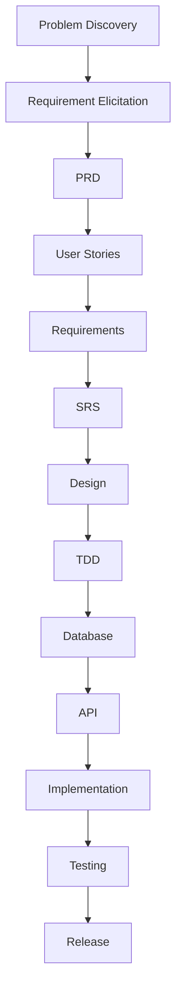

# Smart ToDo Application - Documentation Repository

This repository section contains a complete end-to-end Requirements Engineering and SDLC documentation set for **Smart ToDo**, designed for both industry delivery and university teaching.

## Purpose
1. Provide production-grade project documentation with traceability.
2. Demonstrate full SDLC flow from discovery to release readiness.
3. Serve as a reusable teaching artifact for software engineering courses.

## SDLC Flow

## Technology Baseline
| Layer | Technology |
|---|---|
| Frontend | React (TypeScript) |
| Backend | Python FastAPI |
| Database | MySQL |
| Authentication | JWT |
| Deployment | Docker on AWS |

## Repository Navigation
| # | Document | Focus Area |
|---|---|---|
| 01 | [Project Overview](01-project-overview.md) | Executive context, scope, value |
| 02 | [Problem Statement](02-problem-statement.md) | Current vs future state |
| 03 | [Stakeholder Analysis](03-stakeholder-analysis.md) | Influence-interest, RACI |
| 04 | [Information Gathering](04-information-gathering.md) | Elicitation methodology |
| 05 | [Interviews](05-interviews.md) | Qualitative findings |
| 06 | [Surveys](06-surveys.md) | Quantitative insights |
| 07 | [Feasibility Analysis](07-feasibility-analysis.md) | Technical/economic/operational feasibility |
| 08 | [PRD](08-prd.md) | Product requirements baseline |
| 09 | [User Personas](09-user-personas.md) | Persona definitions |
| 10 | [User Journey](10-user-journey.md) | End-to-end user flow |
| 11 | [User Stories](11-user-stories.md) | Epics and stories |
| 12 | [Acceptance Criteria](12-acceptance-criteria.md) | Gherkin-style criteria |
| 13 | [Functional Requirements](13-functional-requirements.md) | FR-001..FR-050 |
| 14 | [Non-Functional Requirements](14-non-functional-requirements.md) | NFR-001..NFR-025 |
| 15 | [Use Cases](15-use-cases.md) | UC-01..UC-09 |
| 16 | [DFD](16-dfd.md) | Context, Level 0, Level 1 |
| 17 | [SRS](17-srs.md) | IEEE-style SRS |
| 18 | [ERD](18-erd.md) | Entity relationships |
| 19 | [System Design](19-system-design.md) | Architecture and deployment |
| 20 | [TDD](20-tdd.md) | Technical implementation design |
| 21 | [Database Design](21-database-design.md) | Schema, constraints, indexes |
| 22 | [API Design](22-api-design.md) | REST contracts |
| 23 | [Test Plan](23-test-plan.md) | QA strategy |
| 24 | [Test Cases](24-test-cases.md) | TC-001..TC-075 |
| 25 | [Traceability Matrix](25-traceability-matrix.md) | US -> FR/NFR -> API -> TC |
| 26 | [Risk Analysis](26-risk-analysis.md) | Risk register and mitigations |
| 27 | [Project Roadmap](27-project-roadmap.md) | Multi-phase timeline |
| 28 | [Signoff Document](28-signoff-document.md) | Formal approval template |

## Traceability Promise
- Every user story maps to functional requirements.
- Every requirement maps to verification tests.
- All requirements are represented in the traceability matrix.
