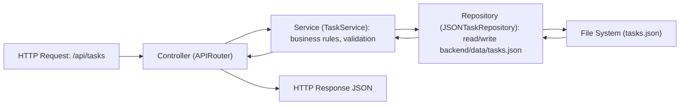
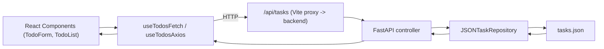
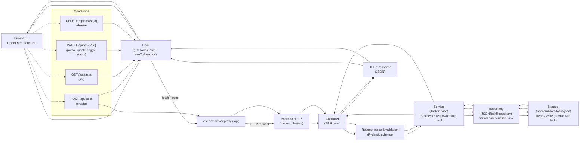

# Smart Todo — API Contract & Project Architecture (Lecture)

This single-file lecture explains the API contract and the code architecture (MVC-style) for the Smart Todo app. It includes concise API examples and two Mermaid diagrams showing backend and frontend data flows.

---

## Overview
- Backend: FastAPI (backend/app) following MVC-like layers: controllers (APIRouter), services (business logic), repositories (data access). Current repository uses JSON file storage (backend/data/tasks.json) for development.
- Frontend: React + Vite (frontend/) using hooks that call backend API. Two example hooks: useTodosFetch (native fetch) and useTodosAxios (axios).

This document covers:
- API contract (endpoints, payloads, responses, errors)
- Data model
- Backend MVC flow (controller -> service -> repository -> file -> repository -> service -> controller)
- Frontend flow (UI -> hook -> API call -> response -> UI update)

---

## API Contract (base path `/api`)

Base path used in dev: `/api` (Vite proxies `/api` to backend at http://127.0.0.1:8000)

All endpoints accept and return JSON. Use header `X-User-Id` to simulate authentication/ownership in dev.

### Create task
- POST /api/tasks
- Request body:
```json
{ "title": "Buy milk", "description": "Optional", "due_date": "2026-07-03T12:00:00Z" }
```
- Response (201):
```json
{
  "id": "uuid",
  "user_id": "frontend-user",
  "title": "Buy milk",
  "description": "Optional",
  "status": "PENDING",
  "due_date": "2026-07-03T12:00:00Z",
  "created_at": "2026-07-03T12:00:00Z",
  "updated_at": "2026-07-03T12:00:00Z"
}
```

### List tasks
- GET /api/tasks
- Response (200): array of task objects (may be empty)

### Update task (partial)
- PATCH /api/tasks/{id}
- Request body: any subset of fields (title, description, due_date, status).
  - Example to toggle status: `{ "status": "COMPLETED" }`
- Response (200): updated task object

### Delete task
- DELETE /api/tasks/{id}
- Response (204) on success; 404 if not found

### Status values
- `PENDING` or `COMPLETED`

### Error format
- Validation errors and other API errors follow FastAPI default error shape. Example validation error:
```json
{
  "detail": [ { "type": "missing", "loc": ["body","title"], "msg": "Field required", "input": {} } ]
}
```
For controller-level errors (e.g., forbidden) responses use standard HTTP codes:
- 400: bad request
- 403: forbidden (ownership)
- 404: not found
- 500: server error (should be rare; improve logging)

---

## Data Model (Task)

Fields:
- id: string (UUID)
- user_id: string
- title: string
- description: string | null
- status: "PENDING" | "COMPLETED"
- due_date: ISO datetime | null
- created_at: ISO datetime
- updated_at: ISO datetime

Pydantic models used (backend/app/models, backend/app/schemas) — see source for exact types.

---

## Backend: MVC Flow (Mermaid)



Notes:
- Controller handles request parsing, dependency for current user (X-User-Id), maps payload to service call and returns dicts.
- Service enforces ownership, sets updated_at timestamps and applies business logic.
- Repository is a thin layer that serializes/deserializes Task objects to/from JSON.
- Replacing JSON repo with a DB (SQLModel/SQLAlchemy) requires implementing the same repository interface and updating DI wiring.

---

## Frontend Flow (Mermaid)



Notes:
- Default frontend behavior uses Vite proxy `/api` to forward requests to backend during development. Alternatively, set `VITE_API_BASE_URL` to call backend directly.
- Two examples are present: useTodosFetch (native fetch) and useTodosAxios (axios). They implement the same semantics: load, add, toggle (PATCH), delete, clearDone.

---

## API call examples

Curl (create):
```bash
curl -X POST http://localhost:8000/api/tasks \
  -H 'Content-Type: application/json' -H 'X-User-Id: demo-user' \
  -d '{"title":"Buy milk"}'
```

Fetch (create):
```js
await fetch('/api/tasks', {
  method: 'POST',
  headers: { 'Content-Type': 'application/json', 'X-User-Id': 'frontend-user' },
  body: JSON.stringify({ title: 'Buy milk' })
})
```

Axios (create):
```js
import axios from 'axios'
const client = axios.create({ baseURL: import.meta.env.VITE_API_BASE_URL || '/api', headers: { 'X-User-Id': 'frontend-user' } })
await client.post('/tasks', { title: 'Buy milk' })
```

Toggle status (fetch -> PATCH):
```js
await fetch(`/api/tasks/${id}`, { method: 'PATCH', headers: { 'Content-Type': 'application/json','X-User-Id':'frontend-user' }, body: JSON.stringify({ status: 'COMPLETED' }) })
```

---

## File layout (high-level)
- backend/
  - app/
    - controllers/  (APIRouter endpoints)
    - services/     (business logic)
    - repositories/ (JSONTaskRepository)
    - models/       (domain models)
    - schemas/      (Pydantic request/response schemas)
    - core/         (config)
  - data/tasks.json (dev persistence)
- frontend/
  - src/hooks/useTodosFetch.ts
  - src/hooks/useTodosAxios.ts
  - src/components/*

---

## Teaching tips (for a lecture)
- Emphasize separation of concerns: controllers are thin, services contain business logic, repositories abstract storage.
- Show how switching repository implementation (JSON -> DB) does not change controllers or most frontend code.
- Walk through a live request: browser -> network -> vite proxy -> FastAPI controller -> service -> repository -> file -> back up the chain.
- Demonstrate error handling (validation errors vs ownership errors).

---

## Next steps (suggested)
- Add a DB-backed repository (SQLModel + Alembic) and a migration plan.
- Add OpenAPI contract examples and unit/integration tests for controllers & services.
- Add a .env.example and update frontend to use VITE_API_BASE_URL in production builds.

---

This file should be used in lecture slides or as a single-point reference for developers onboarding to the Smart Todo project.

---

## Full end-to-end data flow (Frontend -> Backend -> JSON)

The diagram below shows a complete flow for create/list/update/delete operations starting from the browser UI, through the Vite dev proxy (in development), into the FastAPI controller, down to the service and repository, and finally the JSON storage file. Responses follow the reverse path back to the UI.



Notes:
- The Vite proxy is used in development so the frontend can call relative `/api/*` paths and the dev server forwards them to the backend. In production, frontend should call the real API base URL (set via VITE_API_BASE_URL).
- Repository uses an in-process Lock and writes JSON files; this is suitable for local dev only. Replace with a DB and transactional repository for production.
- The diagram highlights the common REST operations and the exact path they take.

---


